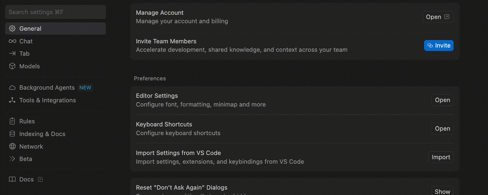
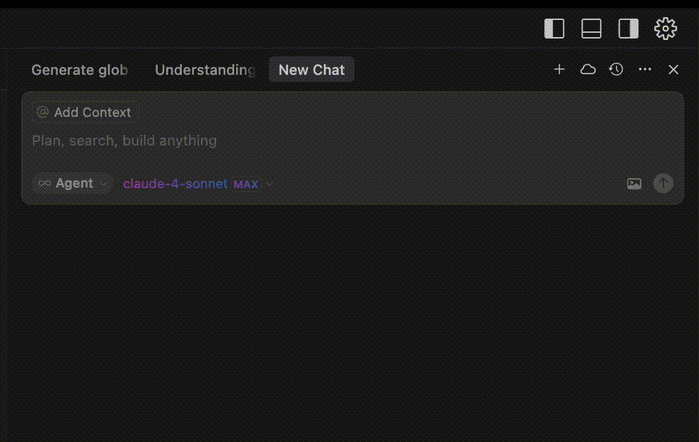

## Summary

- In Cursor, Custom Modes are modes that you create yourself outside of the existing default modes: Agent, Ask, and Manual.
- For each Custom Mode, you give it a simple configuration and some Custom Instructions.
- The files in this directory are the Custom Instructions for Custom Modes in Cursor.
- Custom Modes is a Cursor feature which must be activated in the Cursor settings.

_First enable Custom Modes in Cursor settings_

_Then you can create and use custom modes in the Cursor chat._

### PRD Mode

- Creates a comprehensive PRD for your project that you can refer back to when creating your implementation plans.
- Link to recommended configuration and instructions to add it to Cursor: https://playbooks.com/modes/prd

### Plan Mode

- Generates a comprehensive project implementation plan document to build your app or feature based on a PRD.
- Link to recommended configuration and instructions to add it to Cursor: https://playbooks.com/modes/prd

## Using These Custom Modes

Use the Custom Modes sequentially, like so:

1. Put Cursor in PRD mode. Have it create a PRD for a new feature. It will put this PRD in a temporary markdown file.
2. Then put Cursor in plan mode and have it create the step-by-step plan for the coding agent. It will put this plan in a temporary markdown file.
3. Review the step-by-step plan yourself. Make any changes to ensure that Cursor does exactly what you want it to do.
4. Put Cursor in Agent mode. Drag the implementation into the Chat box as context. Write "Execute the plan in [PLAN MARKDOWN FILE]".
5. Cursor will begin implementing the plan exactly as described.
