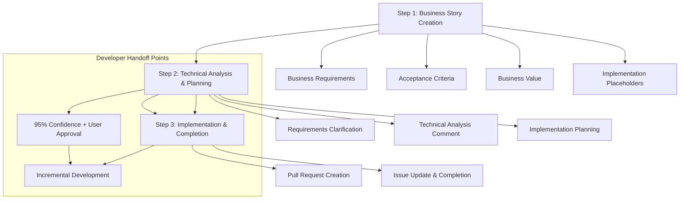

# Working with Stories: Complete AI Assistant Guide

This document provides a comprehensive guide for AI assistants working with GitHub issues, user stories, and implementation workflows. It consolidates the core principles and processes from multiple cursor rules into a single, reliable reference.

## 🎯 Overview

This guide covers the complete lifecycle from business story creation to implementation completion, following a **minimal invasive** approach that preserves business requirements while adding technical details through a simplified 3-step process.

## 📋 Core Principles

- **Business Focus First**: Stories start as pure business requirements
- **Technical Enhancement Later**: Technical details added during implementation planning
- **Minimal Invasive Updates**: Original issue text modified minimally
- **Structured Comments**: Technical analysis and updates via comments
- **GitHub CLI Only**: All GitHub interactions via `gh` commands
- **English Documentation**: All GitHub content in English regardless of communication language
- Load `@.cursor-toolkit/working-with-git.md`

## 🔄 Complete Workflow



## 📊 Step 1: Business Story Creation (PM)

### Purpose

Create pure business-focused user stories without technical implementation details. This step is typically performed by Product Managers and results in a GitHub issue ready for developer handoff.

### Process

1. **Requirements Gathering**
   - Understand business problem
   - Identify target users and their needs
   - Clarify business context and constraints
   - Define expected value and outcomes

2. **Confidence Assessment**
   - **REQUIRED**: Reach 90% confidence in business requirements
   - Ask comprehensive clarifying questions
   - Focus on user needs, not technical solutions
   - Only proceed after explicit user confirmation

3. **Story Structure**

   ```markdown
   # User Story: [Title]

   ## Business Requirements

   ### Description

   As a [user role], I want to [functionality], so that [benefit/value].
   **Context:** [Background information and motivation]

   ### Acceptance Criteria

   - [Specific, testable criteria]
   - [Edge cases and error scenarios]
   - [User experience requirements]

   ### Business Value

   - **Impact:** [Description of business/user impact]
   - **Priority:** [High/Medium/Low with rationale]
   - **Success Metrics:** [How success will be measured]

   ## Implementation Planning

   ### Technical Analysis

   - [ ] **Technical Analysis** (to be completed during implementation planning)

   ### Implementation Tasks

   - [ ] **Implementation Tasks** (to be defined by developer during planning phase)
   ```

4. **GitHub Issue Creation**
   ```bash
   # Create issue using GitHub CLI
   gh issue create \
     --repo "[organization]/[repository]" \
     --title "${STORY_TITLE}" \
     --body-file ".temp/issues/user_story_${TIMESTAMP}_${SHORT_TITLE}.md" \
     --label "user-story,needs-technical-analysis"
   ```

### Key Requirements

- ✅ **Business focus only** - no technical implementation details
- ✅ **90% confidence** in requirements before proceeding
- ✅ **English language** for all GitHub content
- ✅ **Repository confirmation** with user before creation
- ❌ **No user assignment** during creation
- ❌ **No technical analysis** in initial story

---

## 🔧 Step 2: Technical Analysis & Planning (Dev A)

### Purpose

Bridge the gap between business requirements and technical implementation through comprehensive analysis, requirements clarification, and implementation planning. This step is typically performed by a Developer and results in a structured technical analysis comment that enables developer handoff for Step 3.

### Process

1. **Initial Analysis**
   - Download and analyze GitHub issue using GitHub CLI
   - Conduct comprehensive codebase research
   - Study project documentation and architecture
   - Identify affected components and dependencies

2. **Requirements Clarification**
   - Gather all open questions about implementation
   - Proactively ask specific questions to achieve 95% confidence
   - Document all Q&A clearly
   - Continue questioning until confidence threshold reached
   - **95% confidence required before proceeding**

3. **Technical Analysis & Implementation Planning**
   After achieving 95% confidence and user approval, create comprehensive technical analysis comment using this template:

   ```markdown
   ## 🔧 Technical Analysis

   This comment provides the technical analysis for implementing the business requirements defined in the issue above.

   ### Implementation Analysis

   - **Affected Components**:
     - [Component 1]: [Brief description and path]
     - [Component 2]: [Brief description and path]

   - **Dependencies**: [List and impact]
   - **Codebase Impact**: [Areas requiring changes]

   ### Architecture Considerations

   - **Design Patterns**: [Patterns to follow or avoid]
   - **Integration Points**: [How this integrates with existing systems]
   - **Performance Implications**: [Expected performance impact]
   - **Security Considerations**: [Security aspects to address]

   ### Implementation Approach

   - **Technical Solution**: [High-level approach description]
   - **Required Changes**: [Detailed change list]
   - **New Components**: [Components to be created]
   - **Estimated Complexity**: [High/Medium/Low with rationale]

   ### Risk Assessment

   - **Technical Risks**: [Risks and mitigation strategies]
   - **Dependencies**: [External factors]
   - **Assumptions**: [Key assumptions]

   ### Testing Strategy

   - **Unit Tests**: [Approach and coverage]
   - **Integration Tests**: [Approach and coverage]
   - **E2E Tests**: [Approach and coverage]

   ### Implementation Tasks

   The following implementation tasks have been added to the issue above as checkboxes:

   - [ ] [Task 1 - Setup and preparation]
   - [ ] [Task 2 - Core implementation]
   - [ ] [Task 3 - Testing and validation]
   - [ ] [Task 4 - Documentation and cleanup]

   ### Next Steps

   1. Proceed with requirements clarification if needed
   2. Create detailed implementation plan
   3. Begin implementation following the approved plan

   ---

   _This technical analysis was generated during the implementation planning phase and complements the original business requirements above._
   ```

4. **Minimal Issue Body Update**
   - **ONLY** add implementation tasks as checkboxes to existing "Implementation Planning" section
   - **DO NOT** replace or extensively modify original business story text
   - Tasks should be specific and actionable
   - Organized in logical sequence

5. **GitHub Enhancement Process**

   ```bash
   # Add technical analysis as comment
   gh issue comment [issue-number] --body-file [technical-analysis-comment-file]

   # Add implementation tasks as minimal checkbox update (if needed)
   gh issue edit [issue-number] --body-file [minimally-updated-issue-file]

   # Add labels
   gh issue edit [issue-number] --add-label "technical-analysis-complete"
   ```

### Key Requirements

- ✅ **Requirements clarification first** - 95% confidence must be achieved before proceeding
- ✅ **Comprehensive analysis** - architecture, risks, testing, and implementation planning
- ✅ **User approval required** - explicit approval before proceeding to Step 3
- ✅ **Minimal invasive approach** - preserve original business story
- ✅ **Technical analysis as comment** - not in issue body
- ✅ **GitHub CLI only** - no browser interactions
- ✅ **Developer handoff ready** - creates comprehensive technical foundation for Step 3
- ❌ **No GitHub modifications before 95% confidence achieved**
- ❌ **No extensive issue body modifications**
- ❌ **No replacement of original business text**

---

## 💻 Step 3: Implementation & Completion (Dev B)

### Purpose

Implement code following incremental approach with continuous documentation, create pull requests, and complete the story workflow. This step can be performed by the same developer who completed Step 2, or by a different developer using the comprehensive technical analysis as a handoff foundation ("implement only" workflow).

### Process

1. **Branching Strategy**
   - Follow project's branching strategy
   - Create feature branches: `feature/issue-[number]-[description]`
   - Keep branches small and focused

2. **Incremental Approach**
   - Implement code in small, logical units
   - Achieve functional milestones after each step
   - Conduct regular tests

3. **Quality Assurance**
   - Run linters and formatting tools
   - Adhere to project's coding standards
   - Implement appropriate tests for new code
   - Document code adequately

4. **Task Tracking**
   - Update task list after each implementation step
   - Mark completed tasks in markdown file
   - Add new tasks when necessary
   - ALWAYS UPDATE THE IMPLEMENTATION CHECKLIST AFTER EACH MAJOR STEP!

5. **Git Operations**
   **Load Git workflow documentation when needed**: Reference `@.cursor-toolkit/workflows/working-with-git.md` to load Git workflows, GitHub CLI commands, and PR templates.

   **Validation**: Agent must confirm successful loading of Git documentation before performing any Git operations.

   **Story-Specific Git Policy**:
   - **Default Policy**: Recommend Git operations but do not execute them
   - **Explicit User Request Exception**: When user explicitly requests Git operations:
     - Execute with clear confirmation of what will be performed
     - Follow proper commit message formatting and project conventions
     - Provide transparent feedback on operations performed
   - Recommend committing regularly with atomic changes
   - Use branch naming: `feature/issue-[number]-[description]` for story implementations

6. **Pull Request Creation**
   - **When Implementation Complete**: Offer to create PR based on:
     - Structured commit history from feature branch
     - Implementation checklist completion status
     - Technical analysis from GitHub issue comments
     - Original business requirements from issue
   - **PR Template Auto-Generation**: Create comprehensive PR description including:
     - Reference to original issue
     - Summary of implemented features
     - Technical highlights and approach
     - Testing coverage and validation
     - Breaking changes (if any)
     - Follow-up items or known limitations

7. **Issue Update & Completion**
   - **Minimal Issue Updates**: ONLY update checkboxes ([ ] to [x])
   - **Implementation Summary Comment**: Add structured completion comment
   - **Status Management**: Status change occurs through GitHub workflow on PR merge
   - **Follow-up Issues**: Create separate issues for remaining work

### Key Requirements

- ✅ **Incremental development** - small, logical units
- ✅ **Quality standards** - linting, testing, documentation
- ✅ **Task tracking** - continuous progress updates
- ✅ **Git recommendations** - default behavior
- ✅ **Git execution on request** - when explicitly asked
- ✅ **Automated PR creation** - comprehensive, context-aware PRs
- ✅ **Clean completion** - proper issue closure and follow-up management
- ✅ **Developer handoff support** - can work with Step 2 technical analysis from different developer

---

## 🛠️ Git & GitHub CLI Operations

**Load dependency**: `@.cursor-toolkit/working-with-git.md`

For complete Git workflows, GitHub CLI commands, and Pull Request templates, reference the working-with-git.md document.

### Story-Specific File Management

```bash
# Directory Structure for 3-Step Workflow
.temp/
├── issues/                          # Step 1: Business story drafts (PM)
│   └── user_story_[timestamp]_[title].md
└── issue-implementation/            # Step 2 & 3: Implementation files (Dev)
    ├── [repo]-[issue-number].md     # Main implementation tracking file
    ├── [repo]-[issue-number]-analysis.md     # Step 2: Technical analysis comment
    ├── [repo]-[issue-number]-research.md     # Step 2: Research notes
    └── [repo]-[issue-number]-completion.md   # Step 3: Completion comment
```

---

## ⚠️ Critical Rules & Constraints

### Language Requirements

- **ALL GitHub content MUST be in English** (issues, comments, PRs)
- Communication with users can be in their preferred language
- Documentation and code comments in English

### GitHub CLI Requirements

- **NEVER use browser interface** for GitHub operations
- **ALL interactions via `gh` commands**
- Ensures consistency and workflow integration

### No Mocks Policy

- **NEVER use mock data or services** unless explicitly instructed
- **ALWAYS work with real services and integrations**
- Mock usage requires explicit user approval

### Temporary Files

- Store in `.temp/` directories with proper `.gitignore`
- Use naming conventions: `TEMP_*` or dedicated directories
- Clean up when task complete

### Confidence Thresholds

- **90% confidence** for business requirements (Step 1: business story creation)
- **95% confidence** for implementation requirements (Step 2: technical analysis & planning)
- **Explicit user approval** required before proceeding to Step 3

---

## 📚 Templates & Examples

### Business Story Template

```markdown
# User Story: [Clear, concise title]

## Business Requirements

### Description

As a [user role], I want to [functionality], so that [benefit/value].

**Context:** [Background and motivation]

### Acceptance Criteria

- [Specific, testable criterion]
- [Edge case handling]
- [User experience requirement]

### Business Value

- **Impact:** [Business/user impact description]
- **Priority:** [High/Medium/Low with rationale]
- **Success Metrics:** [Measurable outcomes]

## Implementation Planning

### Technical Analysis

- [ ] **Technical Analysis** (to be completed during implementation planning)

### Implementation Tasks

- [ ] **Implementation Tasks** (to be defined by developer during planning phase)
```

### Technical Analysis Comment Template

[See Step 2 section above for complete template]

### Implementation Update Comment Template

[See Step 3 section above for implementation completion guidance]

### Story-Specific Pull Request Template

**Base PR Templates**: Load `@docs/cursor-toolkit-references.md#core-dependencies` to access standard PR templates from the Git workflow documentation.

**Story-Specific Additions**:

```markdown
### Completed Implementation Tasks

- [x] [Task 1 from implementation checklist]
- [x] [Task 2 from implementation checklist]
- [x] [Task 3 from implementation checklist]
- [x] [Task 4 from implementation checklist]

### Story Implementation Context

- **Original Issue**: #[issue-number] - [Business story title]
- **Implementation File**: `.temp/issue-implementation/[repo]-[issue-number].md`
- **Technical Analysis**: See issue comment for detailed technical analysis
- **Business Requirements**: [Reference to original story requirements]
```

---

## 🎯 Success Criteria

A successful story workflow completion includes:

1. ✅ **Clear business requirements** captured without technical details (Step 1)
2. ✅ **Comprehensive technical analysis** added via structured comment (Step 2)
3. ✅ **95% confidence** achieved before implementation (Step 2)
4. ✅ **Explicit user approval** for implementation plan (Step 2)
5. ✅ **Developer handoff capability** - Step 3 can be performed by different developer using Step 2 output
6. ✅ **Incremental implementation** with quality standards (Step 3)
7. ✅ **Context-aware Pull Request** with comprehensive description (Step 3)
8. ✅ **Minimal invasive updates** preserving original business story
9. ✅ **Complete documentation** of decisions and solutions
10. ✅ **Follow-up issues** created for remaining work

---

## 🔗 Related Documentation

This document consolidates all story workflow guidance. For specialized development guidance, reference these thematic documents:

### Core Dependencies

For project-specific dependencies, reference `@docs/cursor-toolkit-references.md#core-dependencies` to load required workflow documentation as needed.

### Specialized Documentation

For project-specific and specialized development documentation, reference `@docs/cursor-toolkit-references.md` with appropriate sections:

- **Technical Architecture**: For system-specific documentation
- **Implementation-Specific**: For technology stack guides
- **Business Context**: For domain-specific requirements

The references.md file provides a structured approach to organizing and selectively loading project documentation as needed.

---

**Usage**: Reference this document via `@.cursor-toolkit/working-with-stories.md` for core story workflow guidance. For project-specific context, selectively load `@docs/cursor-toolkit-references.md` sections as needed to avoid context bloat while maintaining workflow effectiveness.
